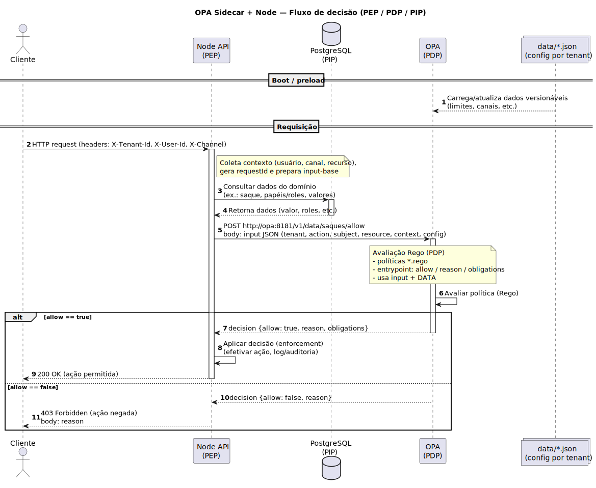
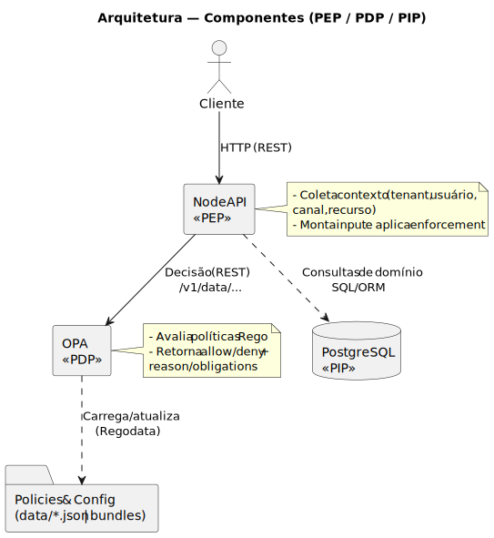

# OPA Sidecar + Node (cloud-agnostic)

Boilerplate que demonstra **Open Policy Agent (OPA)** como **sidecar** de um microserviço **Node.js** (Express), aplicando **políticas Rego**, **configuração por tenant** em `data/config.json` e **PostgreSQL** como PIP (Policy Information Point) para dados de exemplo.

---

## Sumário

- [1) Visão geral e objetivos](#1-visão-geral-e-objetivos)
- [2) Arquitetura](#2-arquitetura)
- [3) Pré-requisitos](#3-pré-requisitos)
- [4) Quick start (5 minutos)](#4-quick-start-5-minutos)
- [5) Estrutura do repositório](#5-estrutura-do-repositório)
- [6) Contrato de decisão (PEP → PDP)](#6-contrato-de-decisão-pep--pdp)
- [7) Políticas Rego — organização mínima](#7-políticas-rego--organização-mínima)
- [8) Configuração por tenant (`data/config.json`)](#8-configuração-por-tenant-dataconfigjson)
- [9) Testes de política (OPA CLI)](#9-testes-de-política-opa-cli)
- [10) Banco de dados (seed & consultas)](#10-banco-de-dados-seed--consultas)
- [11) Observabilidade & decision logs](#11-observabilidade--decision-logs)
- [12) Boas práticas de produção](#12-boas-práticas-de-produção)
- [13) Receitas (fluxos comuns)](#13-receitas-fluxos-comuns)
- [14) Endpoints do boilerplate](#14-endpoints-do-boilerplate)
- [15) Comandos úteis (resumo)](#15-comandos-úteis-resumo)
- [16) Troubleshooting](#16-troubleshooting)
- [17) Checklist de PRs](#17-checklist-de-prs)

---

## 1) Visão geral e objetivos

- **PEP (Policy Enforcement Point)**: serviço Node recebe a requisição, coleta contexto (usuário, canal, dados do recurso) e consulta o OPA.  
- **PDP (Policy Decision Point)**: OPA avalia **políticas Rego** com base no **input** enviado pelo PEP + dados versionáveis (`data/`) e retorna **allow/deny** e metadados.  
- **PIP (Policy Information Point)**: Postgres fornece dados do domínio consultados pelo Node para compor o input.



> **Por que sidecar?** Mantém políticas desacopladas do código, facilita versionamento/distribuição e permite evoluir regras sem redeploy do app.

---

## 2) Arquitetura



- O Node **não expõe** o OPA; comunica via `http://opa:8181` (rede interna do Compose).
- Em produção (ECS/K8s), rode o OPA **na mesma task/pod** do serviço.

---

## 3) Pré-requisitos

- **Docker** e **Docker Compose** instalados.
- Portas padrão: `3000` (API) e `8181` (OPA, **apenas rede interna**).
- Opcional: `curl` e **OPA CLI** (`opa`) para testes locais.

---

## 4) Quick start (5 minutos)

1) **Suba o stack**
```bash
docker compose up --build
```

2) **(Opcional) Popular dados de exemplo**
```bash
curl -X POST http://localhost:3000/seed
```

3) **Simular decisão de saque**
```bash
curl -X POST http://localhost:3000/saques/saque-1/decidir   -H "X-Tenant-Id: TENANT_A"   -H "X-User-Id: u-solicitante"   -H "X-Channel: WEB"
```

**Headers (contrato do PEP)**  
- `X-Tenant-Id`: tenant que direciona config e políticas  
- `X-User-Id`: identidade do solicitante/aprovador  
- `X-Channel`: origem (WEB, APP, API, etc.)

> Dica: crie uma coleção Postman/Insomnia ou arquivo `.http` para repetir os testes.

---

## 5) Estrutura do repositório

```
api/               # microserviço Node (Express) => PEP
  src/
    routes/        # endpoints (ex.: /seed, /saques/:id/decidir)
    services/      # integração com OPA e Postgres
    db/            # queries e seed
  package.json

policies/          # políticas Rego (OPA)
  *.rego

data/              # dados versionáveis
  config.json      # configuração por tenant (limites, canais, etc.)

policy-tests/      # testes unitários de políticas (opa test)
docker-compose.yml
```

---

## 6) Contrato de decisão (PEP → PDP)

**Input típico enviado ao OPA** (exemplo):
```json
{
  "tenant": "TENANT_A",
  "action": "aprovar_saque",
  "subject": { "id": "u-solicitante", "roles": ["solicitante"] },
  "resource": { "tipo": "saque", "id": "saque-1", "valor": 1200.0 },
  "context": { "channel": "WEB", "hora": "2025-08-29T09:00:00Z" },
  "config": { /* projeção de data/config.json para o tenant */ }
}
```

**Resposta típica do OPA**:
```json
{
  "allow": true,
  "reason": "Dentro do limite e canal permitido",
  "obligations": ["log_auditoria"]
}
```
